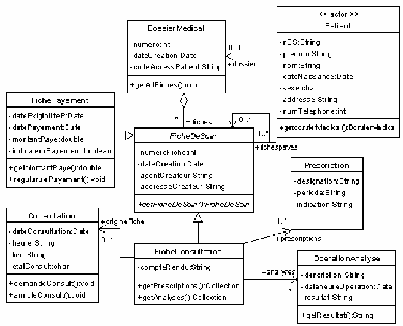

# TP 1
On souhaite implémenter l'ensemble des classes du diagramme suivant:

.

- Créer une classe ihm pour tester les différentes classes

Voici les fonctionnalités demandées :

1. Créer un dossier medical.
    1. Ajouter un patient.
2. Créer une consultation.
    1. Créer la fiche de consultation.
    2. Ajouter une prescription.
    3. Ajouter une operation Analyse.
    4. Créer une fiche de paiement. 

3. Afficher le dossier medical d'un patient.
4. Rechercher une consultation par date et patient.
    1. Afficher la fiche de consultation, opération analyse si il y en a eu.