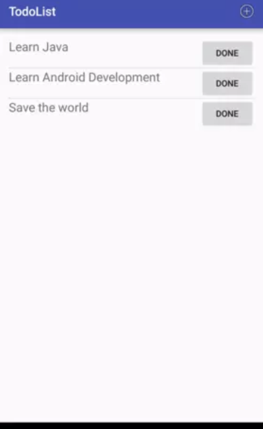
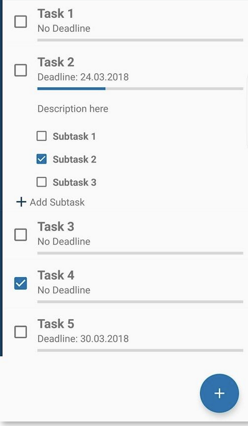

## TP Navigation et recyclerView

**Objectifs :** Le but de ce TP est de mettre en pratique la navigation par fragment et l'utilisation des recycler view.

On souhaite réaliser une application pour gérer notre todoList.

L'application permet de :

- Ajouter une todo à notre todolist
- Changer l'état d'une todo (Fait ou non).
- Supprimer une Todo
- Afficher les todos.

Dans une deuxième version l'application proposera la possibilité d'avoir des sous tasks dans chaque todo.

Exemple d'affichage :

- Version 1 : 
- Version 2 : 

