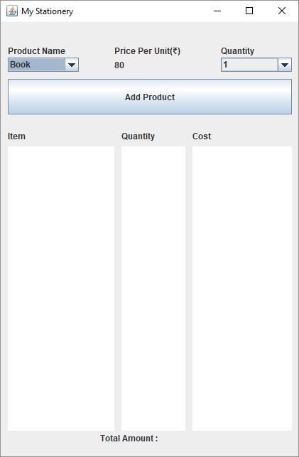

## TP Desktop

Le but de ce TP est de créer des interfaces GUI pour communiquer avec notre api produt(app-product)

L'application aura deux vues :

- Gestion de produit (ajouter un produit, rechercher, mise à jour...)

- Construction d'un panier
