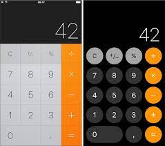

##Exercice 1 Application desktop

**Objectif :** Comprendre le fonctionnement des grids en desktop.

Le but de l'exercice est de réaliser une application calculatrice semblable à la calculatrice ios.

