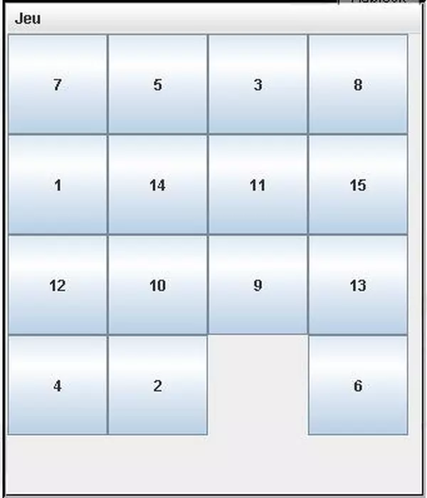

##Exercice 2 Application desktop

**Objectif :** Comprendre le fonctionnement des grids en desktop.

Le but de l'exercice est de réaliser un jeu de taquin.

 - De taille 3x3
 - De taille dynamique

On utilisera la méthode getConstraints(Component) pour récupérer les coordonnées d'un composant et la méthode setConstraints pour modifier les coordonnées d'un composant.

